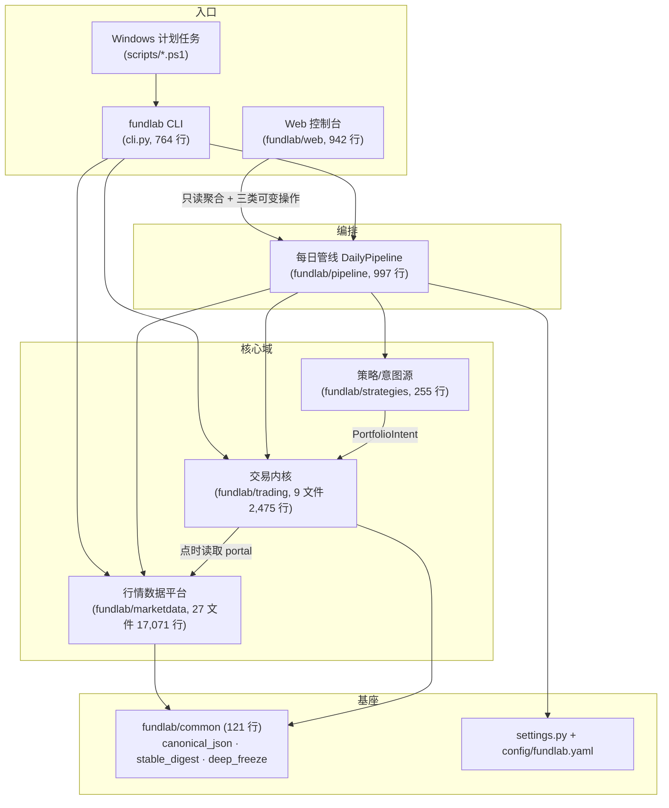
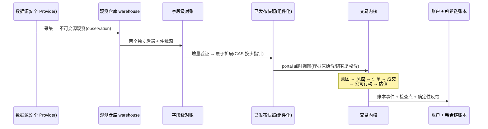

# FundLab 仓库总览

> 本组文档描述仓库在 2026-07-27 清理后的现状。分模块细节见:
> [01-行情数据平台](01-marketdata.md) · [02-交易内核与策略](02-trading.md) ·
> [03-每日管线、CLI 与运维](03-pipeline-ops.md) · [04-Web 控制台](04-web.md) ·
> [05-决策 Agent](05-agent.md)

## 这个系统是什么

FundLab 是一套**单用户、纯本地**的量化基础设施,当前目标刻意收窄为四件事:

1. **可信的多源行情数据**——每个数字都能追溯到具名数据源的不可变观测;
2. **可复现的历史模拟**——同样的输入永远得到同样的结果;
3. **持久的每日模拟账户**——模拟盘按真实交易日历逐日推进,状态永不重建;
4. **可审计的反馈账本**——每次运行产出确定性的收益/回撤/成交/费用反馈。

**不在范围内**:实盘交易与券商对接(2026-07-27 明确决定不做)、Agent 自主修改章程/参数的学习行为。
`paper-agent` 继续运行确定性动量基线；`paper-dividend` 提供首个严格结构化的 LLM 红利价值 Agent，
初始关闭计划调用，完成真实中转预演后再灰度启用。新闻输入与自主学习仍是后续阶段。

## 两条持久边界

整个架构围绕两条不可绕过的路径展开,所有设计纪律都是为了守住它们:

```text
数据边界:  具名数据源 → 不可变源观测 → 字段级对账 → 固定快照
交易边界:  组合意图(PortfolioIntent) → 风控评估 → 单一每日交易内核 → 哈希链账本
```

- 关键行情字段(OHLCV)必须有**两个独立后端**佐证,冲突由第三源仲裁;单源数据、平局、覆盖不全一律**不可发布**。
- 策略(无论静态权重还是外部 Agent)只能以不可变的 `PortfolioIntent` 进入内核,别无它路。
- 历史模拟与每日模拟**共用同一个内核**,唯一区别是时钟;订单、成交、估值全部用**原始价**,复权价只通过点时(point-in-time)研究视图暴露。
- 处处**失败即阻断**(fail-closed):任何环节存疑就停下并留下原因,绝不发布半成品、绝不静默降级。

## 分层架构



依赖方向自上而下,核心域之间只有一条横向依赖:交易内核通过 `marketdata.portal` 的点时视图读行情,行情平台完全不知道交易的存在。

## 目录结构地图

```text
miniQMT/
├── fundlab/                  Python 包(56 文件,约 22,800 行)
│   ├── cli.py                唯一命令行入口,pyproject 注册为 `fundlab`
│   ├── settings.py           config/fundlab.yaml → 冻结 dataclass
│   ├── common/               canonical JSON、稳定哈希、深冻结等基座工具
│   ├── marketdata/           行情数据平台(观测/对账/快照/增量发布)→ 文档 01
│   ├── trading/              交易内核、账户仓库、费用、反馈        → 文档 02
│   ├── strategies/           IntentSource 协议 + 静态/文件决策实现  → 文档 02
│   ├── agent/                决策 Agent(点时筛选→严格评估→决策文件) → 文档 05
│   ├── pipeline/             每日管线编排                          → 文档 03
│   └── web/                  FastAPI 控制台 + 无框架前端            → 文档 04
├── config/fundlab.yaml       全部运行配置(路径/执行/风控/费用/每日)
├── scripts/                  Windows 计划任务注册与执行脚本
├── tests/canonical/          17 个测试文件,178 个用例,全部通过
├── docs/
│   ├── architecture/         本组文档
│   ├── foundation.md         契约、时序、真实性边界与交付历史(英文,含历史记录)
│   └── archive/              早期设计文档存档
└── data/                     全部为 git 忽略的本地数据
    ├── warehouse/v2/         现役仓库:canonical 快照 + trading.sqlite3(6.4G)
    ├── reports/daily/        每日运行报告(运维报告,退出码依据)
    ├── reports/data_v2/canonical/  数据平台报告根目录
    ├── agent/                决策、资料库与追加式记忆(运行期忽略)
    │   ├── decisions/        外部 Agent 的 JSON 决策文件投递点
    │   ├── library/          人工白名单资料(.md/.txt)
    │   └── memory/           每账户 JSONL 评估/邮件记忆
    ├── archive/              一次性构建/验证报告压缩存档(2026-07 归档)
    └── (logs/                 每日运行日志,launcher 写入)
```

## 数据从哪来、到哪去(一条主干)



例行发布**只有一条通道**:`daily run` 走的组件化增量扩展路径(校验日历 → 采集增量 → 对账 → 验证 → CAS 发布)。全量重建、`build-snapshot`、普通 `publish()` 都无法产出或替换模拟快照——这是防止历史被静默改写的核心闸门。

## 日常怎么跑

```powershell
uv sync --dev --frozen --inexact      # xtquant 在 uv.lock 之外,必须 --inexact
uv run fundlab agent decide --all     # 仅运行 scheduled=true 的 Agent 策略
uv run fundlab daily run              # 一条命令:校验日历→扩展快照→推进账户(幂等)
uv run fundlab daily status           # 快照头、账户头寸日、配置概览
uv run fundlab web                    # localhost:8610 控制台
pwsh -File scripts/register-daily-task.ps1   # 注册周二至周六 06:00 计划任务(先决策后运行)
uv run pytest tests/canonical         # 全量测试
```

退出码语义:`0` = 成功或已最新;`2` = 某个失败即阻断的闸门拦下了本次运行,原因在控制台 JSON 与 `data/reports/daily/` 报告里;修复后重跑即从持久观测仓库续传,不会产生半成品。**前置条件:运行时段本地 MiniQMT 客户端必须在线**(xtquant 数据源依赖它)。

## 当前状态(2026-07-27)

| 项 | 值 |
| --- | --- |
| 已发布快照 | `snap-2a502eb188874c6ac7bbfb7f`(6,809 标的,14.9M 日线,数据至 2026-07-24) |
| 模拟账户 | `paper-1`、`paper-agent` 头寸日 2026-07-24；`paper-dividend` 已配置，下一轮 daily 创建并以现金起步 |
| 数据源 | 9 个:tickflow、xtquant、baostock、eastmoney-efinance、eastmoney-fund-public、exchange-public、sina-calendar、sina-etf、cninfo-public |
| 每日配置 | 双源 `[tickflow, xtquant]`,仲裁 `baostock`,收盘截止 19:00,日历前瞻 60 天 |
| 测试 | `tests/canonical` 全量用例通过 |

**2026-07-27 清理记录**:v1 遗留仓库(sqlite/parquet)及其 audit/import 通道、tencent 因子源、一次性构建/验证报告(已压缩至 `data/archive/build-reports-2026-07.zip`)、旧工具痕迹(.codex 等)已全部移除;Web 控制台完成一轮视觉与交互改版。详见 git 历史与 [foundation.md](../foundation.md) 的退役备注。

## 术语表

| 术语 | 含义 |
| --- | --- |
| 源观测 observation | 一次具名数据源采集的不可变结果,内容寻址,永不修改 |
| 字段级对账 reconciliation | 逐字段比较多源观测,冲突需第三源仲裁,产出可发布性判定 |
| 快照 snapshot | 固定(pinned)的规范数据集;内部由四类内容寻址组件构成:市场事实、生效期交易规则、裁决证据、可弃置模拟视图 |
| 增量 increment | 经验证的、与前任快照日期连续且不相交的新分区;唯一的例行发布单位 |
| 组合意图 PortfolioIntent | 不可变的目标权重声明,策略进入内核的唯一形态 |
| 交易内核 kernel | 单日推进函数:意图→风控→订单→成交→公司行动→估值,历史与每日共用 |
| 哈希链账本 ledger | 账户全部事件的链式哈希记录,任何篡改都会断链 |
| 反馈 feedback | 一次运行结束后确定性构建的绩效/成本/完整性汇总 |
| 失败即阻断 fail-closed | 存疑即停止并记录原因,不降级、不发布部分结果 |
| 点时视图 point-in-time | 只暴露"当时可知"数据的读取门面,防止未来函数 |
