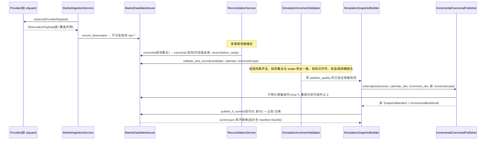
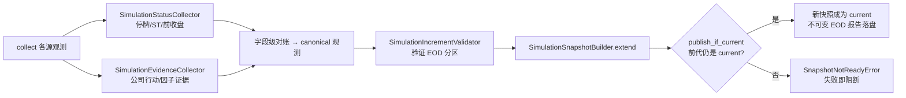

# 行情数据平台(fundlab/marketdata)

## 职责与边界

`fundlab/marketdata` 是整个系统的第一条持久边界:**命名数据源 → 不可变源观测 → 字段级对账 → 固定快照**。它负责把外部世界(9 个数据源)的行情、日历、标的、公司行动、复权因子,变成可复现、可审计、按内容寻址的本地事实库,并以唯一的查询门面 `CanonicalMarketData` 供交易内核与研究使用。

边界内:采集、存证、对账、快照构建/发布、交易规则物化、复权推导、点时读取。
边界外:组合意图、风控、成交模拟(在 `fundlab/trading`)、每日编排(在 `fundlab/pipeline/daily.py`)、界面(`fundlab/web`)。下游只通过快照 ID 和 `CanonicalMarketData` 消费本模块,从不直接触碰源观测文件。

## 核心概念

- **数据源(Provider)**:实现 `MarketDataProvider` 协议(`name` + `capabilities` + `observe()`)的具名上游。`ProviderRegistry` 只做显式路由,注释原文即"never falls back or silently merges sources"——没有回退、没有隐式合并。
- **源观测(observation)**:一次 `observe()` 的完整落盘结果,`ObservationManifest` 记录请求、覆盖声明(`CoverageClaim`)、每个 parquet 文件的 sha256 与行数。观测不可变,是一切下游的证据根。
- **字段级对账(reconciliation)**:`ReconciliationService` 按 `ReconciliationPolicy`(字段级 `FieldRule`:独立后端最少数 `minimum_independent_backends`、容差、优先级)把多个观测合成一个"canonical 观测",每个字段带候选来源与裁决血缘。
- **快照(snapshot)**:`SnapshotPlan`(选择哪些观测切片 `SourceSlice`)+ 质量报告 + 文件清单 = `SnapshotManifest`。就绪档位 `ReadinessProfile`:`research_price`(研究价可用)与 `simulation`(模拟可用,要求最严);`legacy_unknown` 仅是检查态,禁止发布与查询。
- **组件(component)**:`cmp-` 前缀、按内容寻址的内部存储单元(`ComponentStore`),四种 `ComponentKind`:`market_facts` / `trading_rulebook` / `field_adjudications` / `simulation_view`。快照只钉住组件身份与 `(priority, ordinal)` 叠放序,组件存储细节对外不可见。
- **增量(increment)**:在已发布快照之上追加一段新交易日的组件,不重开历史,经比较-交换原子发布。这是唯一的例行发布通道(见"不变量")。
- **宇宙范围(`UniverseScope`)**:快照声明的不可变标的全集与历史边界(`definition` / `as_of_date` / `history_start` / `history_end` / 逐一钉住的 `instrument_ids`)。当前宇宙定义常量为 `CURRENT_SH_SZ_STOCK_ETF_UNIVERSE`。

## 文件地图

| 文件 | 行数量级 | 职责 |
|---|---|---|
| `contracts.py` | ~300 | 全部契约:5 张表 `MarketTable`、8 种能力 `ProviderCapability`、`PriceMode`、`ReadinessProfile`、`UniverseScope`、观测/快照数据类,以及 `MarketDataError` 错误树(`ProviderSelectionError`、`ObservationError`、`SourceConflictError`、`ReconciliationError`、`TradeRuleError`、`SnapshotNotReadyError`、`IntegrityError`)。 |
| `warehouse.py` | ~1150 | `MarketDataWarehouse`:观测落盘(`record_observation`)、快照构建(`build_snapshot` / `build_partitioned_snapshot` / `build_component_snapshot`)、加载校验、发布(`publish` / `publish_if_current`)。`WAREHOUSE_SCHEMA_VERSION = 6`;`current.json` 指针带 manifest sha256。 |
| `components.py` | ~800 | `ComponentStore`:内容寻址组件仓库。组件 ID 由表规范化帧摘要派生;`SourceProjection` 支持对既有观测的零拷贝投影;读取时按 scope 投影过滤。 |
| `schema.py` | ~660 | 表结构唯一权威:`ColumnSpec`、`BUSINESS_SCHEMAS`、`LINEAGE_SCHEMA`、`TABLE_KEYS`;`normalize_table` / `validate_snapshot_tables` / `empty_table`;涨跌停价按 tick 的舍入辅助。 |
| `providers.py` | ~50 | `ProviderRegistry`:显式注册与路由,校验返回身份与请求一致。 |
| `sources/` | 共 ~4500 | 9 个数据源 + `base.py`(HTTP 传输、哈希、代码转换)。`default_provider_registry()` 注册全部;`source_statuses()` 报告可用性。 |
| `ingestion.py` | ~70 | `MarketIngestionService`:`capture`(捕获一次具名观测)与 `capture_resumable`(仅当既有观测的完整覆盖声明恰好包住请求边界才复用)。 |
| `reconciliation.py` | ~650 | `ReconciliationPolicy` / `FieldRule` / `ReconciliationService`:字段级对账,产出带 `kind = "field_level_reconciliation"` 与 `reconciliation_ready` 标记的 canonical 观测;`default_reconciliation_policy` 为缺省策略。 |
| `history.py` | ~2100 | `HistoryDatabaseBuilder`:可续传(检查点 + 构建锁 + 分片)的多源研究历史构建,缺省源对 `DEFAULT_SOURCE_PAIR = ("tickflow", "baostock")`;窄范围新上市接入可绑定一个已记录的官方 universe observation 作为 master override,但必须同时验证完整 SH/SZ stock/ETF 请求、七个官方端点、表行数/覆盖声明、双重 `as_of_date` 与上市窗口;若历史主表随后仍滞后,只允许以连续的当前已发布组件化模拟快照证明该代码已入库,前序快照 ID 会绑定到锁、构建/队列身份、检查点及 canonical observation;`compose_history_snapshot` 拼接互斥分区;`derive_current_research_snapshot` 投影到当前宇宙。 |
| `simulation_data.py` | ~2200 | 模拟数据线:`SimulationEvidenceCollector`(公司行动/因子证据)、`SimulationStatusCollector`(停牌/ST/前收盘)、`build_dense_simulation_bars`、`reconcile_simulation_status`、`SimulationIncrementValidator`(增量验证;用完整已验证日历前缀计算 IPO 交易日序号,但只发布本次窗口)、`SimulationSnapshotBuilder`(增量扩展入口)。 |
| `incremental.py` | ~1300 | `IncrementalCanonicalPublisher`:组件化增量发布(`bootstrap` 一次性迁移、`extend` 例行扩展、`compare` 影子比对、`apply_scoped_update` 范围修订),`IncrementalBuildAudit` 记录是否重开了历史日线组件。 |
| `trade_rules.py` | ~890 | 交易规则物化:`materialize_daily_trade_rules`(逐日规则与涨跌停)、`resolve_order_quantity_rule` / `resolve_stock_trade_rule`、`audit_provider_price_limits`(用源观测审计涨跌停)、`apply_corroborated_historical_limit_exceptions`。 |
| `etf_rules.py` | ~420 | `EtfRuleEvidenceBuilder`:按交易所产品子类(含跨境 ETF 子类)取证 ETF 涨跌停比率并核验复用规则。 |
| `corporate_actions.py` | ~1180 | `reconcile_corporate_action_factors` / `build_factor_audit_candidates`:公司行动与复权因子的经济一致性对账(现金/送股/拆分与因子倍数互证)。 |
| `adjustments.py` | ~90 | `derive_ratio_adjusted_bars`:点时前复权推导;`visible_factor_ids`。 |
| `portal.py` | ~420 | 唯一查询门面 `CanonicalMarketData`(注释原文:"The only query surface for version-pinned canonical market data")与 `PointInTimeMarketView`;类型化 `Instrument` / `DailyBar` / `CorporateAction` / `MarketSession`。 |

9 个数据源(`name` / 独立后端组 `backend_group` / 能力):`tickflow`(tickflow-unverified;raw+adjusted 日线)、`eastmoney-efinance`(eastmoney;日线+状态)、`eastmoney-fund-public`(eastmoney;ETF 公司行动)、`exchange-public`(exchange-public;标的宇宙;ETF 完整列表按 `listingDate <= as_of_date` 截面化,原始响应计数/哈希和被排除的未来代码保留审计)、`sina-etf`(sina;ETF raw 日线)、`sina-calendar`(sina;交易日历)、`baostock`(baostock;标的+日历+raw 日线等)、`cninfo-public`(cninfo;股票公司行动)、`xtquant`(xtquant;日线+复权因子等,需 MiniQMT 在线)。对账策略以 `backend_group` 计独立性——两个 eastmoney 源只算一个独立后端。

## 关键流程

**一次源观测从采集到进入已发布快照(每日增量路径)**:

**每日管线中的数据段(`fundlab/pipeline/daily.py` 调用序)**:

**为什么 increment 扩展是唯一例行发布通道**:`warehouse.publish` 对 `simulation` 就绪档直接拒绝(要求走 `publish_if_current` 的比较-交换);`publish_if_current` 又要求继任者是组件化快照;而 `IncrementalCanonicalPublisher.extend` 要求前代已组件化、宇宙定义相同、`history_end` 严格后移、标的集合只增不减——`bootstrap` 仅是一次性迁移入口,代码里明确写着它"is not a routine update fallback"。因此模拟线的每一次发布都必然是:在现任快照之上、只追加新交易日组件、原子换指针。全量重建路径在例行运转中不存在。

**portal 如何区分模拟价与研究价**:模拟侧(交易内核)用 `bars(..., price_mode=PriceMode.RAW)` 或 `session()`,拿到的 `DailyBar` 是原始价,并携带执行专属字段——`previous_close`、`limit_up` / `limit_down`、`trade_rule_id`、手数与最小变动价位。研究侧用 `PriceMode.ADJUSTED` 或 `adjusted_history()`:复权价**不落盘**,而是查询时由 `derive_ratio_adjusted_bars` 用原始价 × 点时可见因子(`effective_date` 与 `known_date` 都 ≤ `as_of`)现算,且强制把 `previous_close` / `limit_up` / `limit_down` 置空(注释原文:留着会"suggest false cross-event comparability")。任何 `end_date > as_of` 的查询直接抛错——未来数据在类型层面就取不到。

## 对外接口

**Python(下游模块用法)**:

- `CanonicalMarketData.open(root, snapshot_id=None, required_readiness=ReadinessProfile.SIMULATION)` — 交易内核与研究的唯一入口;省略 `snapshot_id` 即取 `current.json` 指向的已发布快照。方法:`instrument` / `instruments` / `trading_days` / `next_trading_day` / `bars` / `adjusted_history` / `session`。
- `PointInTimeMarketView(market_data, as_of)` — 把 `as_of` 钉死后交给策略,策略无法越界看未来。
- `MarketDataWarehouse(root)` — 管线与 CLI 使用;`fundlab/pipeline/daily.py` 组合 `SimulationStatusCollector` → `reconcile_simulation_status` → `build_dense_simulation_bars`(研究价仍是 OHLC 权威,状态源只补停牌/ST/前收)→ `SimulationEvidenceCollector` → `SimulationIncrementValidator` → `SimulationSnapshotBuilder` 完成数据段;继任快照的 `UniverseScope.as_of_date` 固定为本次官方清单目标日。
- 包顶层 `fundlab/marketdata/__init__.py` 重导出全部公共名字,CLI 只从包根导入。

**CLI(`fundlab data ...`,pyproject 注册)**:

| 命令 | 作用 |
|---|---|
| `sources` | 列出 9 个上游通道与客户端可用性(`source_statuses`) |
| `collect` | 捕获一次具名观测(`--provider` + `--capability`,`--refresh` 强制新采) |
| `reconcile` | 字段级对账,产出 canonical 观测与限定快照 |
| `collect-status` / `collect-evidence` | 可续传采集停牌/ST/前收盘、公司行动与因子证据 |
| `validate-simulation-increment` | 组装并验证一个已对账 EOD 分区 |
| `extend-simulation` | 验证连续 EOD 增量并(可选)原子发布——例行发布命令 |
| `build-history` / `compose-history` / `derive-current-research` | 研究历史构建、分区拼接、当前宇宙投影 |
| `build-snapshot` / `inspect` | 单观测建快照(research 档)、检查快照 |

## 不变量与约束

- **失败即阻断(fail-closed)**:每张观测表必须有显式 `CoverageClaim`;快照加载即校验每个文件的 sha256 与 parquet 行数(`_verify_files`),不符抛 `IntegrityError`;`current_snapshot_id()` 校验指针内 manifest 哈希;就绪不满足一律 `SnapshotNotReadyError`,没有降级路径。
- **观测不可变、来源具名**:`ProviderRegistry.observe` 校验返回的 `provider` 身份与请求一致;`capture_resumable` 只在完整覆盖声明恰好包住请求边界时复用,否则重新采集。
- **发布原子性与线性历史**:模拟快照只能经 `publish_if_current` 比较-交换发布,前代不是现任即失败;指针替换用临时文件 + `os.replace` + 文件锁,跨进程安全。
- **增量不重开历史**:`IncrementalBuildAudit` 记录本次构建实际打开的前代日线组件,已发布历史(`increment_start` 之前)不被触碰;未来日历会话的重叠由 `(priority, ordinal)` 叠放决定,最新公告胜出。
- **无成交证据不等于无行**:全窗口停牌时,有些源返回空表,BaoStock 会返回 `suspended=true` 的平价零成交占位行;两者都可作为独立 no-trade 证据。占位行必须同时满足 OHLC 平价、成交量为零、成交额为空或为零;否则仍视为活跃/含糊证据并失败关闭。
- **幂等**:历史构建带检查点与构建锁可续传;`SimulationSnapshotBuilder` 的 EOD 报告按内容哈希命名,重跑内容一致则静默,内容冲突即抛错("Immutable simulation EOD report collision")。
- **哈希绑定**:组件 ID 由规范化帧摘要派生(内容寻址),观测/快照清单逐文件记 sha256,当前指针绑定 manifest 哈希——任何一层被改动都会在读取时暴露。
- **点时纪律**:所有历史查询必须显式给 `as_of`,`end_date > as_of` 抛错;复权因子按 `known_date` 过滤,复权行剥离执行专属字段;对账候选按独立 `backend_group` 计数,同集团多源不虚增置信。

## 测试对应(tests/canonical)

| 测试文件 | 覆盖 |
|---|---|
| `test_marketdata.py` | contracts / warehouse / ingestion / portal 基础闭环 |
| `test_source_providers.py` | 9 个数据源的观测行为与身份校验 |
| `test_reconciliation.py` | 字段级对账策略、独立后端计数、冲突裁决 |
| `test_components.py` | 组件内容寻址、投影读取、叠放 |
| `test_incremental.py` | 增量扩展、影子比对、审计(不重开历史) |
| `test_simulation_data.py` | 状态/证据采集、增量验证、EOD 扩展与原子发布 |
| `test_history_builder.py` | 可续传历史构建、分片、快照拼接 |
| `test_trade_rules.py` / `test_etf_rules.py` | 交易规则物化、涨跌停审计、ETF 规则取证 |
| `test_corporate_action_reconciliation.py` / `test_eastmoney_fund_actions.py` | 公司行动-因子经济一致性、ETF 行动源解析 |
| `fixtures.py` | 共享的合成数据源与仓库夹具 |
