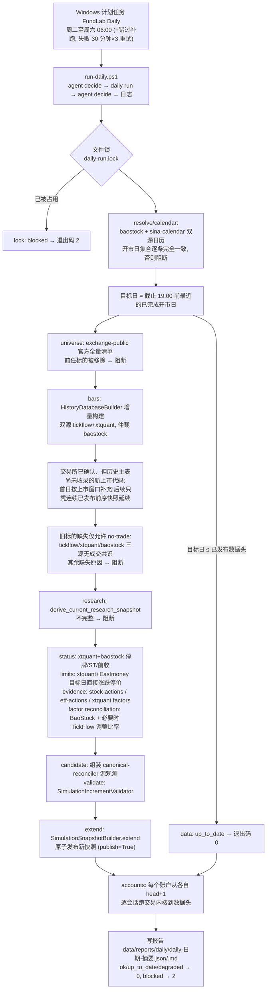

# 每日管线、CLI 与运维

## 职责与边界

本部分覆盖仓库的"编排层与操作面":`fundlab/pipeline/daily.py`(每日自动化编排)、`fundlab/cli.py`(唯一命令行入口,pyproject 中注册为 `fundlab = "fundlab.cli:main"`)、`fundlab/settings.py` + `config/fundlab.yaml`(配置装载)、`scripts/` 下两个 PowerShell 运维脚本,以及它们读写的数据目录。

边界纪律:这一层**只编排、不裁决**。所有信任决策(双源字段级对账、无成交共识、增量校验、原子发布)都留在 `fundlab/marketdata` 的既有组件里;所有交易语义(风控、成交、账本)都留在 `fundlab/trading` 的交易内核里。系统性门槛失败仍结构化阻断;小范围、可精确归属到标的的数据可用性缺口进入显式隔离,不伪造价格或成交。

## 核心概念

- **一轮 daily run**:一次幂等的每日循环 = "把已发布快照向前延伸到最近一个已完成交易日" + "把所有配置的模拟账户推进到数据头"。两半可分别用 `--skip-data` / `--skip-accounts` 跳过。
- **系统性失败即阻断(fail-closed)**:`DailyPipelineBlocked(stage, reason, detail)` 用于日历、schema、对账、账本/数据库、发布冲突及超出隔离边界的缺口;整轮状态为 `blocked`,退出码 2,报告照常写盘。
- **有界降级**:同时满足“最多 200 只”和“不超过全市场 3%”的标的级缺数可隔离,连续最多 5 个交易日;第 6 日硬阻断。隔离行无 OHLC、禁止交易,持仓只使用最后可信价估值,到期订单顺延。
- **退出码语义**:`DailyRunResult.exit_code` —— 状态 `ok`、`up_to_date` 或 `degraded` 返回 0,`blocked` 返回 2。CLI 顶层捕获任何异常也返回 2 并向 stderr 打印结构化 JSON。
- **进程级互斥**:`_exclusive_daily_lock` 用 OS 级文件锁(Windows `msvcrt.locking` / POSIX `fcntl.flock`)锁定 `builds/.locks/daily-run.lock`,防止 Web 触发与计划任务并发;锁随进程消亡,崩溃后不会残留。并发时抛 `DailyRunInProgress`,记为 `lock` 阶段阻断。
- **会话截止(session_cutoff)**:本地时间 19:00 前运行,目标日回退到上一个开市日——避免把未收盘的当日当作已完成会话。
- **日历前瞻(calendar_horizon_days=60)**:日历观测窗口刻意伸到今天之后 60 天,携带交易所已公告的未来会话,使得在数据头做出的组合意图能在快照日历内排定 T+1 订单。

## 文件地图

| 文件 | 行数量级 | 职责 |
|---|---|---|
| `fundlab/pipeline/daily.py` | ~990 行 | `DailyPipeline` 类:整轮编排、双源日历校验、数据延伸、账户推进、报告写盘 |
| `fundlab/pipeline/__init__.py` | 3 行 | 导出 `DailyPipeline` / `DailyRunResult` / `DailyStage` |
| `fundlab/cli.py` | ~760 行 | argparse 子命令树,所有输出走 `canonical_json`;报告写盘用 `_write_immutable_report`(已存在且内容不同则拒绝覆盖) |
| `fundlab/settings.py` | ~165 行 | `load_foundation_settings` 把 YAML 装载为冻结 dataclass;相对路径以配置文件所在目录为基准解析 |
| `config/fundlab.yaml` | ~110 行 | 唯一配置文件:paths / daily / execution / risk / fees 五段 |
| `scripts/register-daily-task.ps1` | ~40 行 | 注册 Windows 计划任务 "FundLab Daily" |
| `scripts/run-daily.ps1` | 30 行 | 计划任务实际执行体:跑 `uv run fundlab daily run` 并落日志 |

## 关键流程

### 次日早晨 06:00 的一轮 daily run

账户推进细节(`_advance_accounts`):打开当前已发布快照(`CanonicalMarketData.open`)与 `TradingRepository`,以配置中的执行/风控/费率策略构造 `SimulationService`;账户时钟边界是**数据头**(`scope.history_end`)而非日历末端。每个账户:不存在则按配置初始现金创建;从已选状态的父 run 末日 +1 起,对每个交易日调用 `service.run_daily(account_id, session, 组合意图源)`——`static` 策略用 `StaticAllocationSource(weights)`,`agent-file` 策略用 `FileIntentSource(data/agent/decisions, account_id, session)`(无决策文件即持有)。单账户异常记为该账户 `blocked`,不影响其他账户,但整轮状态转 `blocked`。最后一个 run 会附带 `build_simulation_feedback` 的权益/收益/质量摘要进报告。

### 幂等性与被阻断后的恢复

- 全程幂等:源观测捕获走 `capture_resumable`(同范围已完整则复用);已验证的日历观测按输入观测 ID 精确匹配复用(`_matching_validated_calendar`);同一前序/universe/日历/日期/标的集合的 canonical no-trade 分区只在已通过三独立后端校验后复用;目标日双源直接涨跌停观测按单标的成功累积,重试只重抓未解决标的;公司行动先与 xtquant 因子核对,未解决事件只补采 BaoStock 因子,仍缺失时才用 TickFlow 原始/前复权价格比率做目标事件审计,所有审计输入都按精确请求复用;目标日不超过已发布数据头时直接 `up_to_date`;账户按 run 链头推进,重复运行不会重放会话。
- 股票公司行动的日常入口是巨潮公告索引，不再逐日重抓全市场历史：完整扫描权益分派、配股与补充/更正公告后，只对公告命中的股票和 `pending.json` 中尚待结构化详情的股票调用逐股接口。pending 按公告 ID 逐条解析和清除，同股另一条行动不会顺带清掉未解决公告；未受影响股票直接继承前序快照。成功扫描、失败前已取得的原始分页响应、哈希、水位和待办位于 `data/warehouse/v2/indexes/cninfo-stock-actions/`，采集报告分别列出全宇宙、公告命中、实际新请求、复用详情、完成和缺失范围。公告跨页唯一数、总数、字段或首屏复查异常一律硬阻断；少量详情暂不可用可按每日隔离边界降级完成并立即写入 `LAST-RUN-DEGRADED`。若详情显示前序历史事件被新增、删除或任一业务字段改值（包括到账/上市日、数量倍数或除权日移动），则以精确标的/事件/字段差异硬阻断，日任务不会自动改写历史。
- 新上市标的不会触发全历史重建：daily 对每个目标日刷新一次缺省历史主表；同一目标日的失败重试固定复用观测日期不早于目标日的最新完整主表，使 history/research 身份和下游检查点保持稳定（行情观测仍按原范围可续传复用）。`exchange-public` 的 ETF 完整列表可能提前公布未来代码，因此先按 `listingDate <= as_of_date` 形成目标日截面，并保留原始响应计数/哈希及未来代码排除清单。仅当代码来自该目标日完整主表（完整 SH/SZ stock/ETF 请求、七个端点均成功、端点行数与表/唯一 complete claim 一致、request/source 两处 `as_of_date` 都等于目标日）、`listed_date` 落在本次增量窗口、关键元数据齐全时，`HistoryDatabaseBuilder` 才以该不可变官方观测作为显式 master override，对新代码单独采集双源行情并建立互不重叠的补充分区。若后续交易日历史主表仍未收录该代码，只能用“当前已发布、组件化、范围连续且标的身份完全一致”的模拟前序快照继续补充；该前序快照 ID 会进入构建身份和 canonical 审计记录。源行情、状态或后续证据不足仍针对该精确代码失败关闭；没有可信前序证明的更早上市代码视为历史修正，不能伪装成新股自动接入。
- 被阻断后:**修复原因后直接重跑同一条命令**,管线从持久化的观测仓库续传,不需要任何手工清理。最终失败维护 `logs/daily/LAST-RUN-BLOCKED`;降级完成维护包含报告路径、完整隔离标的/原因/连续天数的 `logs/daily/LAST-RUN-DEGRADED`,并在日志打印 `[DEGRADED]`;干净成功会清除两个标记。

## 对外接口

### `fundlab` CLI 子命令树(`fundlab --config config/fundlab.yaml <command>`)

**`data` 系列**(源观测与快照管理,均操作 `MarketDataWarehouse`):

- `data sources` — 列出直连上游通道与已安装客户端状态;
- `data collect` — 按 provider + capability 捕获一次命名源观测(可 `--refresh` 强制重采);
- `data build-history` — 可续传地构建双源(可选第三仲裁源)研究价历史库,支持分片(`--shard-count/--shard-index`)与 `--assemble-only` 汇装;
- `data reconcile` — 对若干源观测做字段级对账,产出 canonical 观测与快照(SIMULATION 就绪度禁止直接 `--publish`);
- `data build-snapshot` — 从单个显式观测构建快照;
- `data compose-history` — 拼合互不重叠的已验证历史分区;
- `data derive-current-research` — 把不可变研究快照投影到一个精确的当前沪深全集;
- `data collect-status` / `data collect-evidence` — 可续传采集停牌/ST/前收状态、公司行动与复权因子;
- `data validate-simulation-increment` — 组装并校验一个已对账 EOD 分区;
- `data extend-simulation` — 手动路径:校验连续 EOD 增量并可 `--publish` 原子发布;
- `data inspect` — 查看当前或指定快照的质量、计划与文件清单。

**其余顶层命令**:

- `account create/show` — 创建/查看隔离的持久模拟账户;
- `simulate` — 以静态组合意图直接驱动共享交易内核(`--date` 单日 / `--start-date --end-date` 历史区间,`--promote-historical` 可晋升历史链);费率表未标记 `trusted_for_simulation` 时拒绝运行,除非 `--allow-untrusted-fees`;
- `daily run` — 上述整轮循环(`--target-date/--skip-data/--skip-accounts`);
- `daily status` — 打印快照头、各账户 head、决策目录与截止时间等配置;
- `web` — 启动本地控制台(默认 `127.0.0.1:8610`,自动开浏览器,`--no-browser` 关闭)。Web 端触发的 daily run 与计划任务共享同一把文件锁。

### 配置结构(`FoundationSettings`)

`config/fundlab.yaml` 五段,一一映射到冻结 dataclass:

- `paths` → `FoundationPaths`:`market_data`(`data/warehouse/v2/canonical`)、`trading_database`(`data/warehouse/v2/trading.sqlite3`)、`report_root`(`data/reports/data_v2/canonical`);
- `daily` → `DailySettings`:`session_cutoff_local: "19:00"`、`agent_decision_dir`、`report_dir`、`source_pair: [tickflow, xtquant]`、`adjudicator: baostock`、`batch_size: 100`、`calendar_horizon_days: 60`、`accounts`(`DailyAccountSettings`,strategy 只允许 `static`/`agent-file`,static 必须带 weights)——当前配置了 `paper-1`、`paper-agent` 与已启用周度评估的 `paper-dividend`;
- `execution` → `ExecutionPolicy`:参与率上限、滑点/冲击 bps、涨跌停阻断、部分成交;
- `risk` → `RiskPolicy`:单仓权重上限、最低现金权重、允许资产类型;
- `fees` → `FeeSchedule`:带生效区间与证据说明的分段费率规则,`trusted_for_simulation: true` 是模拟内核放行的显式声明(它是版本化的模拟假设,不是真实券商账户的声明)。

### 运维脚本与数据目录

- `scripts/register-daily-task.ps1`:注册计划任务 "FundLab Daily"——周二至周六 06:00(`-Time` 可改),在上游数据稳定后处理前一交易日;`StartWhenAvailable` 错过补跑,失败 30 分钟间隔重试 3 次(幂等所以安全),4 小时执行上限,`IgnoreNew` 拒绝并发实例;卸载用 `Unregister-ScheduledTask -TaskName "FundLab Daily" -Confirm:$false`。
- `scripts/run-daily.ps1`:切到仓库根,在 daily 前尝试 `uv run fundlab agent decide --all`,daily 成功发布后再幂等补一次(用新账本头和新日历为下个交易日预置决策);任一最终决策失败仅记 `LAST-AGENT-HOLD` 标记,契约上等于持有,详见[05-决策 Agent](05-agent.md)。全部输出追加到 `logs/daily/run-<时间戳>.log`;瞬时 provider transport/观测提交故障最多重试 3 轮(等待 30/60 秒)。`degraded` 不重试且退出 0,但写 `LAST-RUN-DEGRADED` 并打印醒目标记;结构、schema、对账或数据冲突仍立即阻断。
- 数据目录布局:
  - `data/warehouse/v2/canonical/{observations,components,snapshots,builds,current.json}` — 观测仓库、组件、快照与当前发布指针;
  - `data/warehouse/v2/trading.sqlite3` — 账户与哈希链账本;
  - `data/reports/daily/` — 每轮 `daily-<日期>-<摘要10位>.json/.md` 双格式报告;
  - `data/reports/data_v2/canonical/` — 构建/对账/模拟等组件级不可变报告;
  - `data/agent/decisions/` — Agent 文件决策投递目录(按账户、按需创建);
  - `data/agent/library/` / `memory/` — LLM Agent 的白名单资料与追加式本地记忆;
  - `data/archive/build-reports-2026-07.zip` — 历史构建报告归档;
  - `logs/daily/` — 计划任务运行日志(首次运行时创建)。

## 不变量与约束

- **系统性错误仍阻断**:日历分歧、标的集合异常、schema/对账/账本/数据库错误、增量校验冲突或发布失败都终止整轮。只有完整记录原因且在 200 只/3%/连续 5 日三重边界内的标的级可用性缺口可以降级发布。
- **幂等重入**:重跑不重复采数(可续传捕获 + 观测复用)、不重复发布(up_to_date 短路)、不重放账户会话(按 run 链头推进);OS 级文件锁保证任意时刻至多一轮。
- **哈希与不可变绑定**:报告文件名嵌入 `stable_digest` 内容摘要;CLI 的 `_write_immutable_report` 拒绝以不同内容覆盖已存在报告;每轮报告完整记录各阶段的 observation_id / snapshot_id,可追溯到具体源观测。
- **双源一致性**:日历要求 `baostock` 与 `sina-calendar` 在含未来 60 天的整个窗口上开市日集合完全一致;行情增量要求 `tickflow`+`xtquant` 双源对账、`baostock` 仲裁;整段缺失必须由三源无成交共识解释。
- **停牌占位仍是无成交**:三源无成交共识允许“源无行”或“显式 `suspended=true`、OHLC 平价、零成交量且成交额为空/为零”的占位行;任何非平价、实际成交量/成交额或非显式停牌都会阻断,不能被转成空研究分区。
- **账户时钟边界 = 已发布数据头**:日历虽伸向未来,账户只推进到 `history_end`,保证 T+1 订单由次日发布的真实价格执行。
- **单账户故障隔离**:一个账户阻断不阻止其他账户推进,但会把整轮状态压成 `blocked`(退出码 2),迫使运维关注。
- **运行前置条件**:MiniQMT 客户端必须在线(xtquant 数据源),否则数据阶段阻断——两个脚本的注释均明确标注此要求。

## 测试对应

- `tests/canonical/test_daily_pipeline.py`(7 个用例):幂等性与静态账户推进、日历双源分歧阻断、agent 账户"无决策即持有/有决策即执行"、`--skip-data/--skip-accounts`、19:00 截止回退上一会话、文件锁互斥、`_scoped_events` 与 missing_source 原因判定;
- `tests/canonical/test_cli.py`:CLI 只暴露组件化的模拟发布流程(命令面收敛)、提交的费率表边界日期有效、端到端"建账户 + 跑共享内核";
- `tests/canonical/test_agent_file_source.py`:`FileIntentSource` 语义——缺失决策为持有、决策内容哈希绑定、畸形/错配决策失败即阻断、账户隔离、权重规范化;
- `tests/canonical/test_runtime_surface.py`:守住已删除的运行时表面不复活、`strategies` 包只暴露组合意图源、`trading` 公共面只含 canonical 契约;
- `tests/canonical/test_web_api.py`:Web 控制台对 daily run 的触发路径(与本层共享文件锁)。
