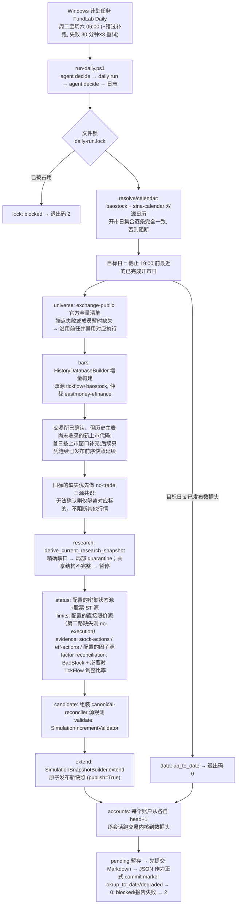

# 每日管线、CLI 与运维

## 职责与边界

本部分覆盖仓库的"编排层与操作面":`fundlab/pipeline/daily.py`(每日自动化编排)、`fundlab/cli.py`(唯一命令行入口,pyproject 中注册为 `fundlab = "fundlab.cli:main"`)、`fundlab/settings.py` + `config/fundlab.yaml`(配置装载)、`scripts/` 下两个 PowerShell 运维脚本,以及它们读写的数据目录。

边界纪律:这一层**只编排、不裁决**。所有信任决策(双源字段级对账、无成交共识、增量校验、原子发布)都留在 `fundlab/marketdata` 的既有组件里;所有交易语义(风控、成交、账本)都留在 `fundlab/trading` 的交易内核里。已采集且通过价格对账的正常数据不得被其他标的或辅助证据故障拖住；问题必须收缩到最小范围并显式标记，不伪造价格或成交。

## 核心概念

- **一轮 daily run**:一次幂等的每日循环 = "把已发布快照向前延伸到最近一个已完成交易日" + "把所有配置的模拟账户推进到数据头"。两半可分别用 `--skip-data` / `--skip-accounts` 跳过。
- **数据优先、执行保守**:官方名单暂不可用时沿用上一份可信成员表并标记 stale；直接涨跌停等执行辅助证据缺失时保留真实 OHLC/成交量，使用 `cn-execution-evidence-gap-no-execution-v1` 禁止成交并顺延到期订单。即使本轮所有价格都只能形成精确 quarantine，也不按数量升级为全局阻断；只有日历、schema、manifest/CAS、持久化或审计提交等不可切分的共享事实失败时才暂停新发布，并保留上一可信状态。
- **永不连坐的标的级降级**:单个或任意数量标的缺数都只隔离对应标的，不设会反向拖死整批的数量、比例或连续天数阈值。停牌候选若某个独立源反而给出活跃记录,不得伪装成停牌,而是连同活跃观测 ID 一起进入同一标的级隔离。真实价格缺失的隔离行无 OHLC、`suspended=null`;辅助证据缺失则保留可信 OHLC/成交量。两者都用专用 no-execution rule 禁止成交，持仓按可信价格估值，到期订单顺延。
- **退出码语义**:`DailyRunResult.exit_code` —— 状态 `ok`、`up_to_date` 或 `degraded` 且正式 JSON 报告已提交时返回 0,`blocked` 返回 2。CLI 顶层捕获任何异常也返回 2 并向 stderr 打印结构化 JSON；计划任务包装器把“退出 0 但本轮没有新正式报告”同样视为 2。
- **进程级互斥**:`_exclusive_daily_lock` 用 OS 级文件锁(Windows `msvcrt.locking` / POSIX `fcntl.flock`)锁定 `builds/.locks/daily-run.lock`,防止 Web 触发与计划任务并发;锁随进程消亡,崩溃后不会残留。并发时抛 `DailyRunInProgress`,记为 `lock` 阶段阻断。
- **会话截止(session_cutoff)**:本地时间 19:00 前运行,目标日回退到上一个开市日——避免把未收盘的当日当作已完成会话。
- **日历前瞻(calendar_horizon_days=60)**:日历观测窗口刻意伸到今天之后 60 天,携带交易所已公告的未来会话,使得在数据头做出的组合意图能在快照日历内排定 T+1 订单。

## 文件地图

| 文件 | 行数量级 | 职责 |
|---|---|---|
| `fundlab/pipeline/daily.py` | ~990 行 | `DailyPipeline` 类:整轮编排、双源日历校验、数据延伸、账户推进、报告写盘 |
| `fundlab/pipeline/__init__.py` | 3 行 | 导出 `DailyPipeline` / `DailyRunResult` / `DailyStage` |
| `fundlab/cli.py` | ~760 行 | argparse 子命令树,所有输出走 `canonical_json`;报告写盘用 `_write_immutable_report`(已存在且内容不同则拒绝覆盖) |
| `fundlab/settings.py` | ~165 行 | `load_foundation_settings` 把 YAML 装载为冻结 dataclass;相对路径以配置文件所在目录为基准解析 |
| `config/fundlab.yaml` | ~110 行 | 唯一配置文件:paths / daily / execution / risk / fees 五段 |
| `scripts/register-daily-task.ps1` | ~40 行 | 注册 Windows 计划任务 "FundLab Daily" |
| `scripts/run-daily.ps1` | 30 行 | 计划任务实际执行体:跑 `uv run fundlab daily run` 并落日志 |

## 关键流程

### 次日早晨 06:00 的一轮 daily run

账户推进细节(`_advance_accounts`):打开当前已发布快照(`CanonicalMarketData.open`)与 `TradingRepository`,以配置中的执行/风控/费率策略构造 `SimulationService`;账户时钟边界是**数据头**(`scope.history_end`)而非日历末端。每个账户:不存在则按配置初始现金创建;从已选状态的父 run 末日 +1 起,对每个交易日调用 `service.run_daily(account_id, session, 组合意图源)`——`static` 策略用 `StaticAllocationSource(weights)`,`agent-file` 策略用 `FileIntentSource(data/agent/decisions, account_id, session)`(无决策文件即持有且只读取持仓/挂单/权益依赖)。单账户异常只影响该账户；只要另有账户成功或部分推进，账户阶段和整轮均为 `degraded`，已提交 head 不回滚。只有全部实际尝试的启用账户都未能推进时账户阶段才是 `blocked`。交易提交后的反馈构造失败只把该账户标为 `degraded`，不会误报为交易未提交。

### 幂等性与被阻断后的恢复

- 全程幂等:源观测捕获走 `capture_resumable`(同范围已完整则复用);行情日期范围扩展时从不可变仓库选择同源、同标的、同参数的最长已验证前缀，只向上游请求新后缀，再记录带完整前缀/后缀血缘的组合观测；已验证的日历观测按输入观测 ID 精确匹配复用(`_matching_validated_calendar`);同一前序/universe/日历/日期/标的集合的 canonical no-trade 分区只在已通过三独立后端校验后复用;目标日双源直接涨跌停观测按单标的成功累积，未覆盖标的进入 execution-evidence guard 而不阻止价格发布;公司行动先与配置的因子源核对,未解决事件仍可用 BaoStock 因子和 TickFlow 原始/前复权价格比率做目标事件审计;目标日不超过已发布数据头时直接 `up_to_date`;账户按 run 链头推进,重复运行不会重放会话。
- 股票公司行动的日常入口是巨潮公告索引，不再逐日重抓全市场历史：完整扫描权益分派、配股与补充/更正公告后，先把分红预案、股东/董事提议、提示性方案以及纯 H 股公告归为不可执行披露并在报告中记录忽略原因；只对正式实施公告、配股公告、可能改变 A 股生命周期字段的更正/调整公告，以及 `pending.json` 中尚待结构化详情的股票调用逐股接口。pending 按公告 ID 逐条解析和清除，同股另一条行动不会顺带清掉未解决公告；未受影响股票继续生成 canonical evidence。更正/调整公告会用独立结构化观测对照前序已接受记录，无业务字段变化时保留一次非阻断确认并在第二次独立确认后清除。成功扫描、失败前已取得的原始分页响应、哈希、水位和待办位于 `data/warehouse/v2/indexes/cninfo-stock-actions/`，采集报告分别列出全宇宙、全部公告命中、可执行命中、已忽略公告及原因、实际新请求、复用详情、完成和缺失范围。公告跨页唯一数、总数、字段或首屏复查等无法精确归属的结构异常仍暂停该次新发布；正式实施详情暂不可用只隔离对应标的。若详情显示前序历史事件被新增、删除或任一业务字段改值（包括到账/上市日、数量倍数或除权日移动），routine daily 不自动改写历史，而是只对精确标的/事件/字段建立 correction quarantine 与 no-execution guard；干净股票继续。历史修正必须另走 exact dependency closure、allowed-diff 与 CAS 审计流程。
- 新上市标的不会触发全历史重建：daily 对每个目标日刷新一次缺省历史主表；同一目标日的失败重试固定复用观测日期不早于目标日的最新完整主表，使 history/research 身份和下游检查点保持稳定。`exchange-public` 的 ETF 完整列表可能提前公布未来代码，因此先按 `listingDate <= as_of_date` 形成目标日截面，并保留原始响应计数/哈希及未来代码排除清单。官方端点暂不可用时只沿用上一份可信成员表并标记降级，不会猜测新代码。仅当代码来自该目标日完整主表、`listed_date` 落在本次增量窗口且关键元数据齐全时，`HistoryDatabaseBuilder` 才以不可变官方观测作为显式 master override，对新代码单独采集双源行情。若后续交易日历史主表仍未收录该代码，只能用范围连续且标的身份完全一致的已发布模拟前序继续补充。源行情、状态或后续证据不足必须收缩到该精确代码：价格缺失进入 quarantine，只有执行辅助证据不足则保留价格并进入 execution-evidence guard；没有可信前序证明的更早上市代码视为待处理历史修正，不得拖住其他标的的当日发布。
- 被阻断后:**修复原因后直接重跑同一条命令**,管线从持久化的观测仓库续传,不需要任何手工清理。若 canonical 指针或账户已提交而报告提升失败,重跑会在 daily 锁内先验证并补齐隐藏 pending 收据,再继续本轮幂等业务；不会仅凭 pending 发布快照。最终失败维护 `logs/daily/LAST-RUN-BLOCKED`;降级完成维护 `logs/daily/LAST-RUN-DEGRADED`,其中记录报告路径、全部 degraded 阶段、degraded/blocked 账户，并在存在价格 quarantine 时附完整标的/原因/连续天数；日志打印非空的 `[DEGRADED]` 摘要。干净成功会清除两个标记。

## 对外接口

### `fundlab` CLI 子命令树(`fundlab --config config/fundlab.yaml <command>`)

**`data` 系列**(源观测与快照管理,均操作 `MarketDataWarehouse`):

- `data sources` — 列出直连上游通道与已安装客户端状态;
- `data collect` — 按 provider + capability 捕获一次命名源观测(可 `--refresh` 强制重采);
- `data build-history` — 可续传地构建双源(可选第三仲裁源)研究价历史库,支持分片(`--shard-count/--shard-index`)与 `--assemble-only` 汇装;
- `data reconcile` — 对若干源观测做字段级对账,产出 canonical 观测与快照(SIMULATION 就绪度禁止直接 `--publish`);
- `data build-snapshot` — 从单个显式观测构建快照;
- `data compose-history` — 拼合互不重叠的已验证历史分区;
- `data derive-current-research` — 把不可变研究快照投影到一个精确的当前沪深全集;
- `data collect-status` / `data collect-evidence` — 可续传采集停牌/ST/前收状态、公司行动与复权因子;
- `data validate-simulation-increment` — 组装并校验一个已对账 EOD 分区;
- `data extend-simulation` — 手动路径:校验连续 EOD 增量并可 `--publish` 原子发布;
- `data inspect` — 查看当前或指定快照的质量、计划与文件清单。

**其余顶层命令**:

- `account create/show` — 创建/查看隔离的持久模拟账户;
- `simulate` — 以静态组合意图直接驱动共享交易内核(`--date` 单日 / `--start-date --end-date` 历史区间,`--promote-historical` 可晋升历史链);费率表未标记 `trusted_for_simulation` 时拒绝运行,除非 `--allow-untrusted-fees`;
- `daily run` — 上述整轮循环(`--target-date/--skip-data/--skip-accounts`);
- `daily status` — 打印快照头、各账户 head、决策目录与截止时间等配置;
- `web` — 启动本地控制台(默认 `127.0.0.1:8610`,自动开浏览器,`--no-browser` 关闭)。Web 端触发的 daily run 与计划任务共享同一把文件锁。

### 配置结构(`FoundationSettings`)

`config/fundlab.yaml` 五段,一一映射到冻结 dataclass:

- `paths` → `FoundationPaths`:`market_data`(`data/warehouse/v2/canonical`)、`trading_database`(`data/warehouse/v2/trading.sqlite3`)、`report_root`(`data/reports/data_v2/canonical`);
- `daily` → `DailySettings`:`session_cutoff_local: "19:00"`、`agent_decision_dir`、`report_dir`、`source_pair: [tickflow, baostock]`、`adjudicator: eastmoney-efinance`、`factor_provider: baostock`、`dense_status_provider: baostock`、`stock_status_provider: baostock`、`batch_size: 100`、`calendar_horizon_days: 60`、`accounts`(`DailyAccountSettings`,strategy 只允许 `static`/`agent-file`,static 必须带 weights)——当前配置了 19 个账户：静态 ETF、单资产动量、LLM 红利，以及非 LLM 的规则红利、双动量、波动率倒数、相关性风险平价、趋势波动率目标、低 Beta/低波动、摘帽动量、在帽 ST 动量和 8 个宽基/卫星 ETF 危机策略变种；股票价格/ST 与危机账户只从创建日起前瞻评价，不生成历史收益结论；危机账户不读取溢价率，跨境风险改由单只仓位上限约束；LLM 红利以 `159207.SZ` 做只读含分红基准，60 个共同交易会话前不允许相对表现参与调仓;
- `execution` → `ExecutionPolicy`:参与率上限、滑点/冲击 bps、涨跌停阻断、部分成交;
- `risk` → `RiskPolicy`:单仓权重上限、最低现金权重、允许资产类型;
- `fees` → `FeeSchedule`:带生效区间与证据说明的分段费率规则,`trusted_for_simulation: true` 是模拟内核放行的显式声明(它是版本化的模拟假设,不是真实券商账户的声明)。

### 运维脚本与数据目录

- `scripts/register-daily-task.ps1`:注册计划任务 "FundLab Daily"——周二至周六 06:00(`-Time` 可改),在上游数据稳定后处理前一交易日;`StartWhenAvailable` 错过补跑,失败 30 分钟间隔重试 3 次(幂等所以安全),4 小时执行上限,`IgnoreNew` 拒绝并发实例;卸载用 `Unregister-ScheduledTask -TaskName "FundLab Daily" -Confirm:$false`。
- `scripts/run-daily.ps1`:切到仓库根,在 daily 前尝试 `uv run fundlab agent decide --all`,daily 成功发布后再幂等补一次(用新账本头和新日历为下个交易日预置决策);任一最终决策失败仅记 `LAST-AGENT-HOLD` 标记,契约上等于持有,详见[05-决策 Agent](05-agent.md)。全部输出追加到 `logs/daily/run-<时间戳>.log`;瞬时 provider transport/观测提交故障最多重试 3 轮(等待 30/60 秒)。每次调用前快照正式报告及已有 pending 名称,只接受本轮新提交的 JSON,不会把旧报告或本轮恢复的旧 pending 误认成当前结果。`degraded` 不重试且退出 0,但写 `LAST-RUN-DEGRADED` 并打印醒目标记;只有无法划定精确影响范围的结构、schema、共享对账或发布故障才立即暂停。
- 数据目录布局:
  - `data/warehouse/v2/canonical/{observations,components,snapshots,builds,current.json}` — 观测仓库、组件、快照与当前发布指针;
  - `data/warehouse/v2/trading.sqlite3` — 账户与哈希链账本;
  - `data/reports/daily/` — 每轮 `daily-<日期>-<摘要10位>.json/.md` 双格式报告；`.pending/` 只保存不可见恢复材料，JSON 是正式 commit marker;
  - `data/reports/data_v2/canonical/` — 构建/对账/模拟等组件级不可变报告;
  - `data/agent/decisions/` — Agent 文件决策投递目录(按账户、按需创建);
  - `data/agent/library/` / `memory/` — LLM Agent 的白名单资料与追加式本地记忆;
  - `data/archive/build-reports-2026-07.zip` — 历史构建报告归档;
  - `logs/daily/` — 计划任务运行日志(首次运行时创建)。

## 不变量与约束

- **只允许不可切分的共享失败暂停新数据头**:没有可信价格并不自动全局阻断；只要每个缺口都能精确归属，就发布对应 DATA_GAP quarantine，哪怕覆盖整个 universe。只有共享日历、无法局部化的 schema/对账、manifest/CAS、持久化/数据库或审计提交失败才停止新发布，并保持上一可信快照不变。股票池、状态、涨跌停、公司行动、因子等可归属异常必须记录原错误并降级，不能阻断无关标的。
- **幂等重入**:重跑不重复采数(可续传捕获 + 观测复用)、不重复发布(up_to_date 短路)、不重放账户会话(按 run 链头推进);OS 级文件锁保证任意时刻至多一轮。
- **哈希与不可变绑定**:报告文件名嵌入 `stable_digest` 内容摘要；写入先 flush/fsync 到唯一临时文件，正式 JSON 用不可覆盖发布并逐字节校验竞态 winner。EOD 在 CAS 前持久化隐藏收据，只有候选已由 verified current 确认为发布结果后才提升正式报告；每轮报告完整记录各阶段的 observation_id / snapshot_id,可追溯到具体源观测。
- **双源一致性**:日历要求 `baostock` 与 `sina-calendar` 在含未来 60 天的整个窗口上开市日集合完全一致;行情增量要求 `tickflow`+`baostock` 双源对账、`eastmoney-efinance` 仲裁;整段缺失必须由配置的三源无成交共识解释。
- **停牌占位仍是无成交**:三源无成交共识允许“源无行”或“显式 `suspended=true`、OHLC 平价、零成交量且成交额为空/为零”的占位行;任何非平价、实际成交量/成交额或非显式停牌都不能冒充停牌，只隔离该标的并保留冲突观测 ID。
- **账户时钟边界 = 已发布数据头**:日历虽伸向未来,账户只推进到 `history_end`,保证 T+1 订单由次日发布的真实价格执行。
- **单账户故障隔离**:一个账户阻断不阻止其他账户推进；存在成功或部分推进账户时整轮为 `degraded`(退出码 0)，只有全部实际尝试的启用账户都无法推进时才为 `blocked`。已提交的逐 session head 永不因后续账户或反馈错误回滚。
- **运行前置条件**:行情、状态和因子使用配置的公开多源；直接限价证据不足时，对应缺口进入隔离/no-execution，其他已验证行情仍继续发布。

## 测试对应

- `tests/canonical/test_daily_pipeline.py`:幂等性、精确 quarantine(包括全 universe)、静态与多账户独立推进、共享日历分歧保留旧 head、`--skip-data/--skip-accounts`、19:00 截止回退、文件锁互斥及报告崩溃恢复;
- `tests/canonical/test_cli.py`:CLI 只暴露组件化的模拟发布流程(命令面收敛)、提交的费率表边界日期有效、端到端"建账户 + 跑共享内核";
- `tests/canonical/test_agent_file_source.py`:`FileIntentSource` 语义——缺失决策为持有、决策内容哈希绑定、畸形/错配决策失败即阻断、账户隔离、权重规范化，以及只读取决策目标与账户状态真实依赖的精确 market scope;
- `tests/canonical/test_runtime_surface.py`:守住已删除的运行时表面不复活、`strategies` 包只暴露组合意图源、`trading` 公共面只含 canonical 契约;
- `tests/canonical/test_web_api.py`:Web 控制台对 daily run 的触发路径(与本层共享文件锁)。
