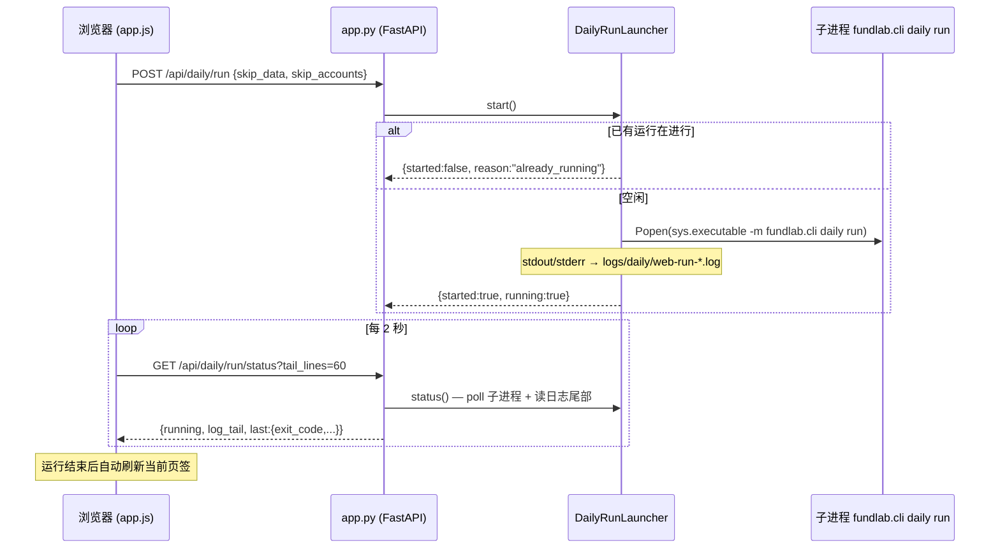
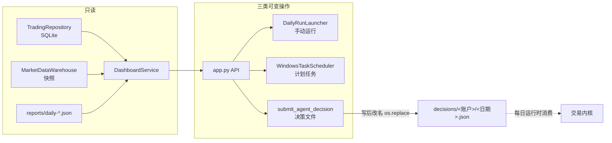

# Web 控制台（fundlab/web）

## 职责与边界

`fundlab/web` 是单用户本地量化基础设施的浏览器控制台，由 `fundlab web` 命令启动（默认 `127.0.0.1:8610`，启动后自动打开浏览器）。它默认只绑定 localhost、**没有任何鉴权**——这是 `app.py` 模块 docstring 里明文声明的边界：控制台是单人本机工具，不为暴露到网络设计。

核心设计边界是"**只管理 CLI 已拥有的东西**"。控制台不引入任何新的数据通道或写入路径，可变操作被严格限定为三类，且每一类都复用已有机制：

| 可变操作 | 复用的已有机制 |
|---|---|
| 计划任务的创建/启停/删除 | Windows 任务计划程序里的 `FundLab Daily` 任务（`scripts/register-daily-task.ps1`） |
| 手动触发每日运行 | 与计划任务完全相同的子进程 `python -m fundlab.cli daily run` |
| 投递 Agent 决策文件 | `agent-file` 策略本来就消费的 `<decision_root>/<account_id>/<date>.json` |

除此之外一切皆只读：交易 SQLite 仓库、快照（当前 snap-2a502eb188874c6ac7bbfb7f）、每日运行报告都由 CLI/管线独占写入，控制台只呈现。删掉整个 web 目录，系统的 canonical 路径不受任何影响。

## 核心概念

- **DashboardService（只读聚合）**：把 `TradingRepository`、`MarketDataWarehouse`、报告目录、决策目录的数据拼装成前端友好的 dict。所有金额以字符串传输，避免 JSON 浮点误差污染 Decimal 语义。
- **单飞（single-flight）手动运行**：`DailyRunLauncher` 同一时刻只允许一个 `daily run` 子进程；由于底层管线幂等，任何结局之后重试都安全。
- **证据等价**：手动运行与计划任务运行走同一条命令行，事后从账本/报告看不出区别。
- **TaskScheduler 协议**：`schedule.py` 定义 `TaskScheduler` Protocol（`query/register/set_enabled/delete`），生产实现是 `WindowsTaskScheduler`，测试注入 FakeScheduler——`create_app` 的 `scheduler`/`launcher` 参数就是为此留的依赖注入口。
- **无框架前端**：`static/` 是手写的 HTML+CSS+JS，无框架、无打包构建步骤。取舍是：单人工具的复杂度上限低，省掉 node 工具链意味着克隆即用、改一行刷新即生效；代价是手写 DOM 拼装（`el()` 辅助函数）和手动状态管理。唯一的第三方库 ECharts 以本地 vendor 文件（`static/vendor/echarts.min.js`）随仓库分发，页面不发任何外网请求。

## 文件地图

- `__init__.py`（3 行）——只导出 `create_app`。
- `app.py`（约 185 行）——FastAPI 应用工厂 `create_app(settings, repo_root=, config_path=, scheduler=, launcher=)` 与全部 API 路由；关闭 `docs_url`/`redoc_url`；挂载 `/static` 并在 `/` 返回 `index.html`；`_valid_time` 校验 HH:MM。
- `service.py`（约 480 行）——`DashboardService`（frozen dataclass）只读聚合 + 唯一的写操作 `submit_agent_decision`；`DashboardError` 表示用户侧请求错误（映射为 404/422）。
- `runner.py`（约 120 行）——`DailyRunLauncher`：加锁单飞启动 `daily run` 子进程，stdout/stderr 合并写入 `logs/daily/web-run-<时间戳>.log`，`status()` 返回运行态与日志尾部。
- `schedule.py`（约 155 行）——`TaskScheduler` Protocol、`ScheduledTaskState`、`WindowsTaskScheduler`：通过 `pwsh`/`powershell` 子进程查询（`Get-ScheduledTask` → JSON）、注册（调 `scripts/register-daily-task.ps1 -Time HH:MM`）、启停、删除名为 `FundLab Daily` 的任务；错误一律抛 `TaskSchedulerError` 上浮到 API（502），不静默吞掉。
- `static/index.html`（约 125 行)——页面骨架：顶栏 + 五个页签（总览/账户/运行记录/计划任务/Agent 决策）+ 全局错误横幅。
- `static/app.js`（约 975 行）——全部前端逻辑：`api()` fetch 封装、`el()` DOM 构造、状态中文映射、五个页签的加载函数、ECharts 净值曲线、运行状态轮询、决策投递表单。
- `static/style.css`（约 450 行）——设计 token 体系：`:root` 定义灰阶梯（`--gray-50`…`--gray-900`，全站唯一灰色来源）、语义色（`--ok/--warn/--bad` 状态色与 `--up/--down` 涨跌色相互独立）、圆角/阴影/字体变量。2026-07-27 完成一轮视觉与交互改版。
- `static/vendor/echarts.min.js`——本地 vendor 的 ECharts，满足"页面零外网依赖"。

## 关键流程

账户详情的聚合值得单独说明：`service.account_detail` 从账户当前选中的头部 run 出发，沿 `parent_run_id` 回溯整条 promoted 链（上限 `_CHAIN_LIMIT` = 20000），拼出跨 run 的完整净值曲线（含初始资金点）、倒序最近事件（默认 200 条）、最近 30 个 run 概要，并对头部 run 调用 `build_simulation_feedback` 生成反馈指标（收益、回撤、成交率、费用等）——与 CLI 侧使用的反馈计算是同一个函数。

## 对外接口

启动：`fundlab web [--host 127.0.0.1] [--port 8610] [--no-browser]`（pyproject 注册的 CLI；`cli.py` 的 `_web` 用 uvicorn 起服务并延时打开浏览器）。程序化使用：`from fundlab.web import create_app`，传入 `FoundationSettings`，测试可注入假的 `scheduler`/`launcher`。

API 路由（全部 JSON）：

| 方法与路径 | 作用 |
|---|---|
| GET `/api/overview` | 总览：快照概要、账户列表、计划任务状态、最近报告、运行状态、配置摘要 |
| GET `/api/accounts` / `/api/accounts/{id}` | 账户列表 / 详情（净值曲线、持仓、挂单、事件、反馈） |
| GET `/api/runs` / `/api/runs/{file}` | 每日报告列表（最多 60 条，按生成时间倒序）/ 单份报告原文 |
| POST `/api/daily/run`、GET `/api/daily/run/status` | 手动触发一次每日运行 / 轮询状态与日志尾部 |
| GET/PUT/DELETE `/api/schedule` | 查询 / 创建或改时间与启停 / 删除 `FundLab Daily` 计划任务 |
| GET `/api/agent/accounts` | 列出 `agent-file` 策略账户（当前即 paper-agent） |
| GET/POST `/api/agent/decisions/{id}` | 决策历史（含无效文件的错误原因）/ 投递新决策 |

前端五个页签与上表一一对应；页签切换按需拉取，窗口重新聚焦（`visibilitychange`）自动刷新当前页签，自动刷新不折叠用户展开的运行详情、不重置净值图上用户拖出的缩放区间（仅切换账户时重置）。净值图为双轴折线（总权益 + 净值），超过 60 个点出现缩放滑条，颜色全部取自 CSS 变量。涨跌数字用 `signed()` 渲染：红涨绿跌（A 股习惯）、正数带 `+`、按展示精度归一化后约等于零的尾差保持中性色。

## 不变量与约束

- **canonical 数据只读**：控制台对交易库、快照、报告没有任何写路径；三类可变操作分别落在 OS 计划任务、子进程和决策文件上，均在 CLI 已有边界之内。
- **手动 = 自动**：手动运行执行与计划任务逐字相同的命令（含 `--config`），日志留在同一 `logs/daily/` 下，证据上不可区分。
- **单飞 + 幂等重试**：`DailyRunLauncher` 用 `threading.Lock` 保证同时至多一个运行；重复触发返回 `already_running` 而非排队。管线本身幂等，所以失败后直接重跑安全。
- **决策文件原子可见**：投递用"写临时文件 → `os.replace` 改名"，并发启动的每日运行不可能读到半写文件；落盘后立刻用 `load_agent_decision`（与账户运行时相同的加载器）回读校验，校验失败即删除文件并报错——磁盘上不会留下内核无法消费的决策。
- **不许改写历史**：账户已推进到 `head_date` 后，不允许再为 `<= head_date` 的日期投递决策（422 拒绝）；同日重复投递必须显式勾选覆盖。权重必须为有限非负数字、合计 ≤ 1、理由必填（写入审计账本）。
- **路径与文件名白名单**：报告名须匹配 `daily-[A-Za-z0-9-]+\.json` 且拒绝 `/`、`\`、`..`；决策名须匹配 `YYYY-MM-DD.json`——目录遍历在 service 层被阻断。
- **错误上浮而非吞掉**：PowerShell 调用失败/超时抛 `TaskSchedulerError` → API 502；总览页里计划任务查询失败降级为 `{"error": ...}` 字段而不拖垮整页。快照读取失败同样降级为错误字段。
- **零外网依赖**：ECharts 本地 vendor，页面不发起任何跨域请求；也因此没有引入 CDN 版本漂移。

## 测试对应

`tests/canonical/test_web_api.py`（约 340 行）用 FastAPI TestClient + 注入 `FakeScheduler` 覆盖全部路由：

- `test_overview_reports_market_accounts_and_schedule` / `test_account_detail_has_curve_positions_events` / `test_runs_listing_and_detail`——三个只读聚合面。
- `test_schedule_lifecycle`——计划任务查询/注册/启停/删除全生命周期。
- `test_agent_decision_submission_validates_and_lists`——决策投递的校验规则与列表回显；`test_invalid_decision_filename_does_not_break_listing`——坏文件名降级为无效条目而非报错。
- `test_manual_run_subprocess_succeeds_offline` / `test_manual_run_single_flight_refuses_concurrent_start`——手动运行真实起子进程且单飞约束成立。
- `test_configured_but_uncreated_account_detail_is_graceful`——已配置未创建的账户返回占位详情而非 404。
- `test_index_serves_dashboard`——根路径返回 `index.html`。

前端（`static/`）无自动化测试，靠上述 API 契约测试加人工浏览验收——这是无构建前端取舍的另一面。
