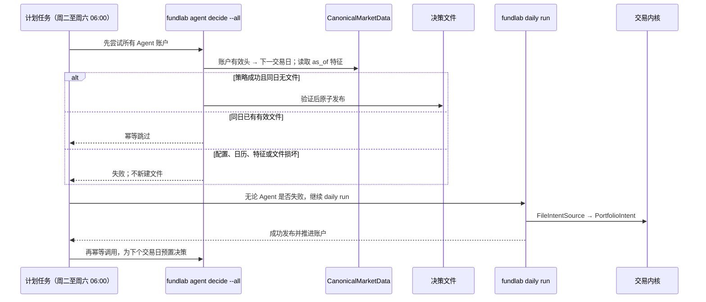

# 决策 Agent（`fundlab/agent`）

`fundlab/agent` 是决策文件契约的第一个仓库内生产者：读取已发布快照的点时视图，
运行配置声明的确定性策略，生成
`data/agent/decisions/<account_id>/<YYYY-MM-DD>.json`。它不直接调用交易内核；
每日管线仍只通过 `fundlab.strategies.FileIntentSource` 把文件转换成
`PortfolioIntent`。

当前 MVP 只包含 `momentum-rotation`。红利价值、新闻/阅读工具、邮件、记忆和 LLM
策略均不在本阶段运行面内。

## 契约与边界

- **点时数据**：策略接口是
  `decide(market: CanonicalMarketData, as_of: date) -> PolicyDecision`。
  特征只从发布快照读取，portal 会拒绝越过 `as_of` 的查询。
- **配置绑定**：`config/fundlab.yaml` 的 `agent.policies.<account_id>` 声明策略和参数；
  策略配置哈希进入决策理由，账本最终绑定决策文件内容哈希。
- **唯一写入路径**：Agent 和 Web 都调用 `write_agent_decision`。候选文件先在唯一
  staging 目录中由内核同款 loader 验证，再原子发布；未授权并发写入只有一个赢家，
  不会静默覆盖。
- **静默与损坏不同**：没有文件表示持有；已有但无效的文件会失败关闭，不能降级为
  持有，`--dry-run` 也不例外。显式覆盖只能替换已验证的有效文件，不会销毁无法
  解析的现场。
- **幂等重试**：同日已有有效文件时，`AgentDecisionService` 返回
  `skipped: already_present`，不改写文件；只有显式 `--overwrite` 才替换内容。

## 决策时点

账户已有账本头 `H` 时，默认决策日是快照日历中 `H` 后的第一个交易日。配置了但尚未
创建账本的新账户，以快照的 `published_end` 作为有效头，因此无人值守流程可以自动
引导。策略数据截止日为：

```text
as_of = min(decision_date, published_end)
```

显式 `--target-date` 必须晚于有效头且是快照日历中的开市日。

## 动量策略

`MomentumRotationPolicy` 计算风险资产过去 `momentum_days` 个已成交会话的复权收盘
动量：

- 动量严格大于阈值：使用 `risk_on` 权重；
- 否则：使用 `risk_off` 权重；
- 历史不足、配置键拼错、权重为负或权重和超过 1：拒绝决策且不落盘。

当前 `paper-agent` 配置以 `510300.SH` 为风险资产、`511010.SH` 为防守资产，使用
60 会话动量。

## 运行流程



Agent 批次失败会写 `logs/daily/LAST-AGENT-HOLD`，但不会把 daily 管线本身标为失败；
daily 成功后的第二次尝试可在首次部署或日历刚扩展时当场恢复。下一次 Agent
全部成功后自动删除该标记。

## 对外接口

- CLI：
  `fundlab agent decide (--account-id X | --all) [--target-date D] [--overwrite] [--dry-run]`
- Web：`POST /api/agent/decide/{account_id}`，body 支持 `dry_run`、`overwrite`
- 配置：

  ```yaml
  agent:
    policies:
      paper-agent:
        type: momentum-rotation
        risk_instrument: 510300.SH
        defensive_instrument: 511010.SH
        momentum_days: 60
        threshold: "0"
        risk_on: {510300.SH: "0.7", 511010.SH: "0.3"}
        risk_off: {510300.SH: "0.1", 511010.SH: "0.9"}
  ```

## 验证

`tests/canonical/test_agent_decision.py` 覆盖点时特征、确定性策略、配置哈希、历史不足、
新账户引导、已有文件幂等、损坏文件失败、dry-run、跨账户失败隔离、原子校验和并发
无覆盖。`tests/canonical/test_web_api.py` 覆盖 Web 预演、投递和幂等重复调用；
`tests/canonical/test_runtime_surface.py` 约束策略包公共面。
